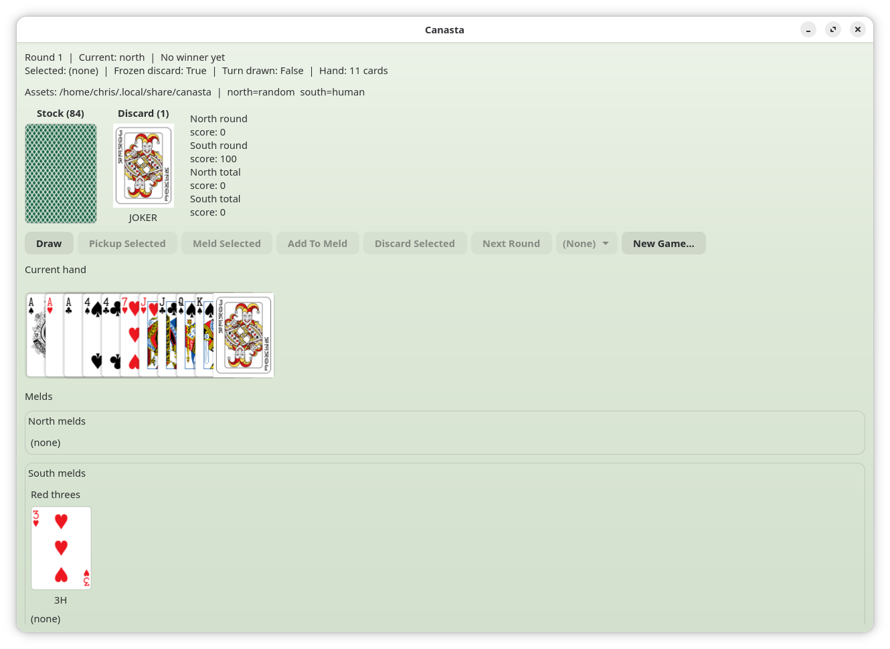
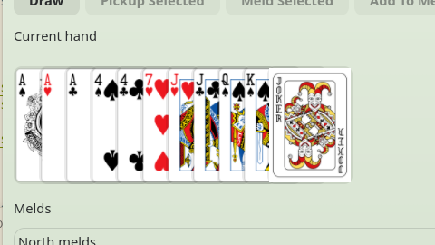
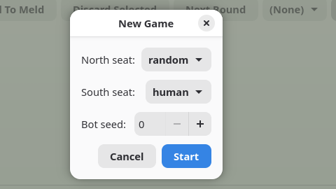
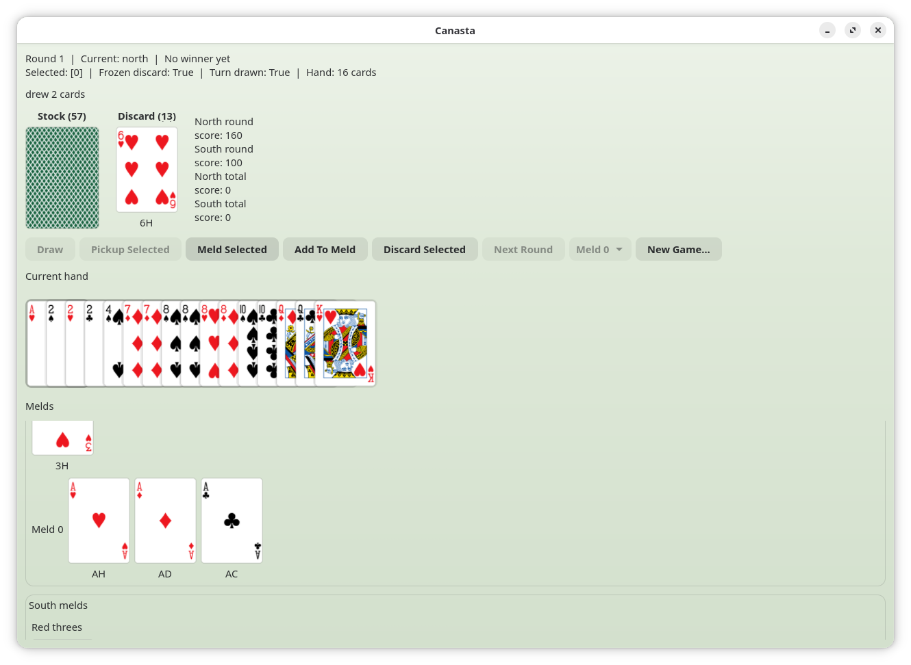

# Canasta

Standalone Canasta project built to teach game architecture incrementally.

## Current Scope

- Pure Python game model and rules.
- Turn-based local two-player engine.
- CLI adapter for interactive play.
- GTK4 GUI adapter for local play.
- Player hands auto-sort by rank/suit for stable command indexing.
- Match play: rounds continue until a side reaches 5000 total points.
- Opening meld minimum scales by current match score (15/50/90/120).

## Quick Start

```bash
cd ~/src/canasta
uv sync
uv run canasta
```

Launch the GTK4 GUI:

```bash
uv run canasta-gui
```

For a fuller game and GUI walkthrough, see [rules.md](./rules.md).

## Screenshots

Current GUI screenshots:

- `docs/screenshots/main-window.png`
- `docs/screenshots/fanned-hand.png`
- `docs/screenshots/new-game-dialog.png`
- `docs/screenshots/add-to-meld.png`






Card art is looked up in the XDG data directory for `canasta`.
Symlink the included ccacards image set:

```bash
ln -sfn /path/to/ccacards/data "$HOME/.local/share/canasta"
```

You can override the asset directory explicitly or choose seat controllers:

```bash
uv run canasta-gui --assets-dir /path/to/card-images
uv run canasta-gui --north human --south greedy
uv run canasta-gui --north aggro --south planner --bot-seed 7
```

In the CLI, use `help` for a command list or `help <command>` for detailed help on a specific command:

```
> help
> help pickup
> help meld
```

To display coloured suit symbols (♠ ♥ ♦ ♣ with red for hearts/diamonds):

```bash
uv run canasta --colours
uv run canasta --north human --south random --colours
```

Run with bots (without colors):

```bash
uv run canasta --north greedy --south random --bot-seed 7
uv run canasta --north safe --south greedy
uv run canasta --north aggro --south planner
```

Run tests:

```bash
uv run pytest -q
```

## Learning Milestones

1. Model and rules as pure functions.
2. Engine command handlers that mutate game state safely.
3. CLI layer that delegates all logic to the engine.
4. Configurable AI opponents (`random`, `greedy`, `safe`, `aggro`, `planner`) with deterministic seeds.
5. GTK4 GUI adapter backed by the same engine.

## Features

### Game State Persistence

The GUI automatically saves game state after each action and on startup.
This allows you to:

- **Resume interrupted games** — Start the app and you'll be prompted to resume or start a new game
- **Multi-session play** — Close the GUI and return to your game later

Saved game state is stored in `$HOME/.config/canasta/game.json` and includes:
- All player hands, melds, and red three cards
- Stock and discard piles  
- Round number and current player
- Both players' scores

### Game Statistics

All-time win/loss records are tracked and displayed in the GUI.
Statistics persist in `$HOME/.config/canasta/stats.json` and survive:
- Application restarts
- Multiple games and rounds
- Different player configurations

The record shows as: `All-time record: North X wins | South Y wins`

### Meld Display Improvements

- **Numerical meld ordering** — Melds are automatically sorted by rank (A through K) for clearer presentation
- **Wild card positioning** — In canastas with wild cards, the natural card is shown prominently with wild cards fanned on the bottom for easy rank identification
- **Clear meld structure** — Both natural and incomplete melds display cards in logical order (natural first, wild last)
